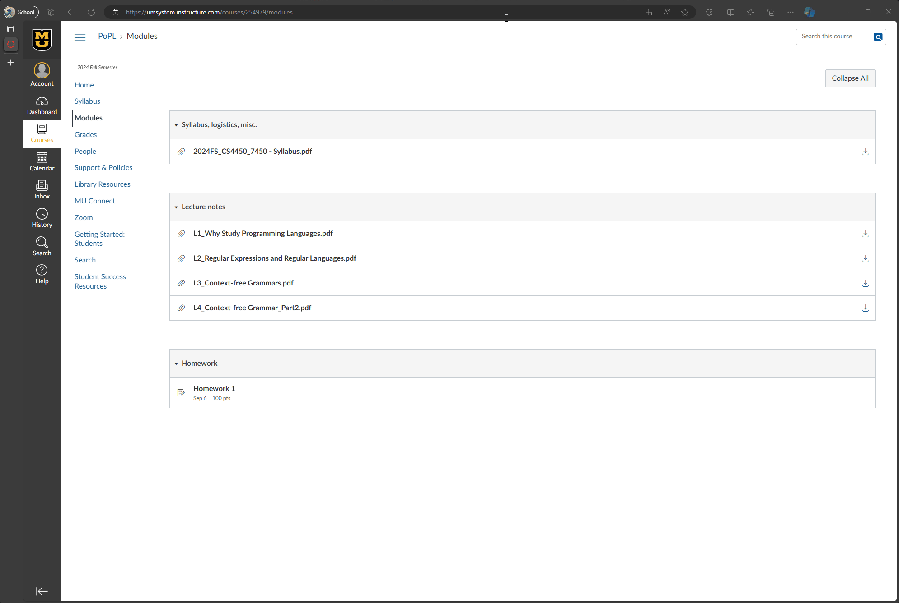

# 🎓 Canvas File Downloader
> A sleek browser extension to streamline your file downloads from Canvas.

Tired of digging through cluttered pages just to get to your files?  
This lightweight extension makes downloading course files on Canvas lightning-fast and hassle-free.

---

## 🚀 Features
- ⚡ **Instant Download Buttons**: Adds quick-access download buttons to Canvas file pages.
- 🎯 **Streamlined Interface**: Clean, minimalist enhancement to fit right in with Canvas' UI.
- 🔄 **Cross-Browser Support**: Available on both Chrome and Firefox.

---

## 🛠️ To-Do
- 👩‍🏫 **Teacher View Testing**: Ensure seamless support for instructor dashboards.

---

## 💡 Got Ideas?
Have a feature in mind or found a bug? Feel free to open an issue or contribute!
